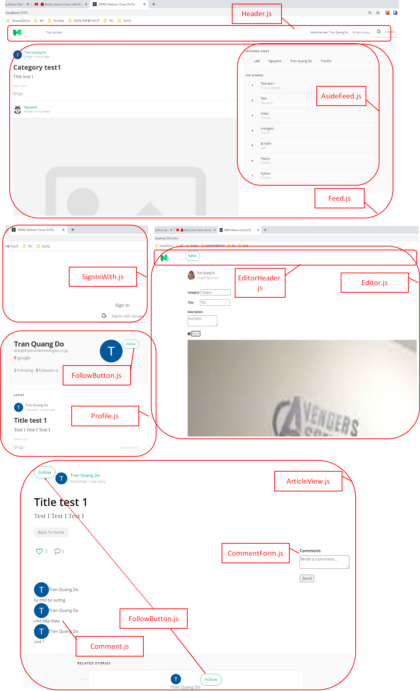
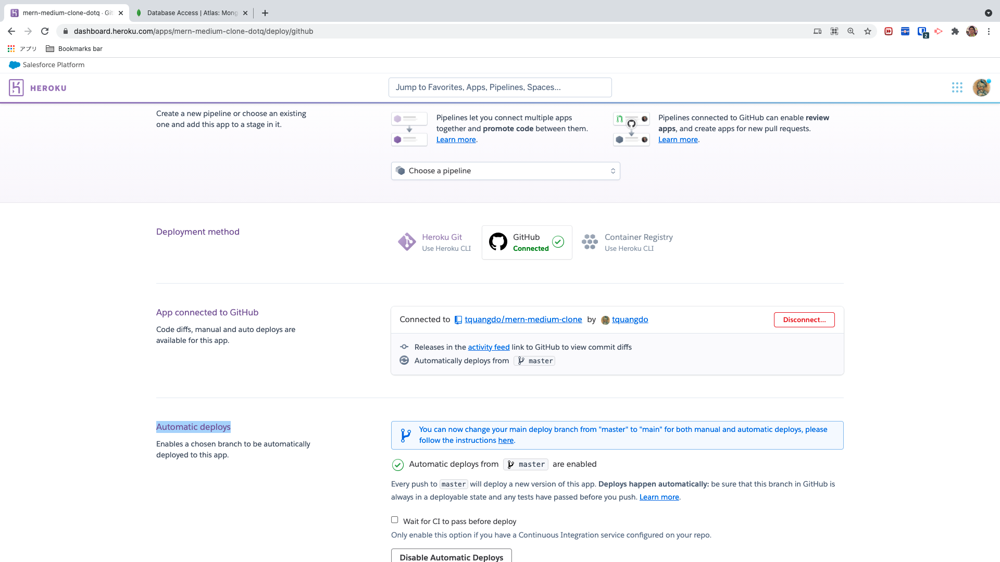
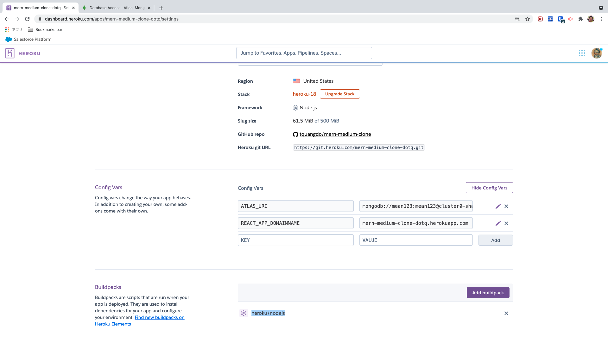
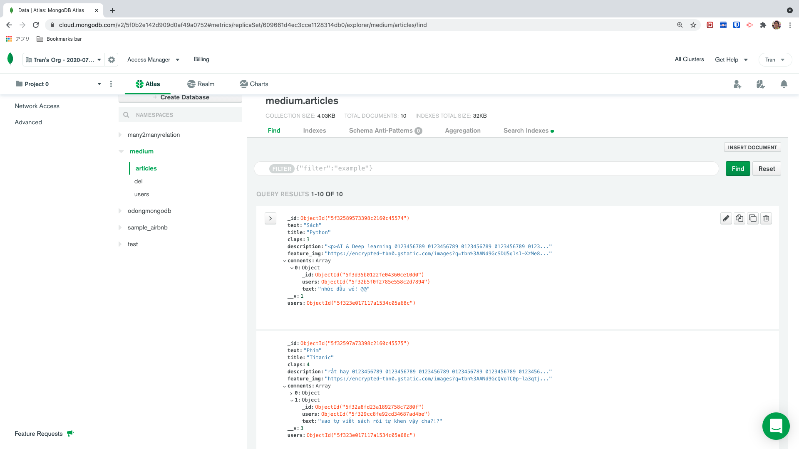
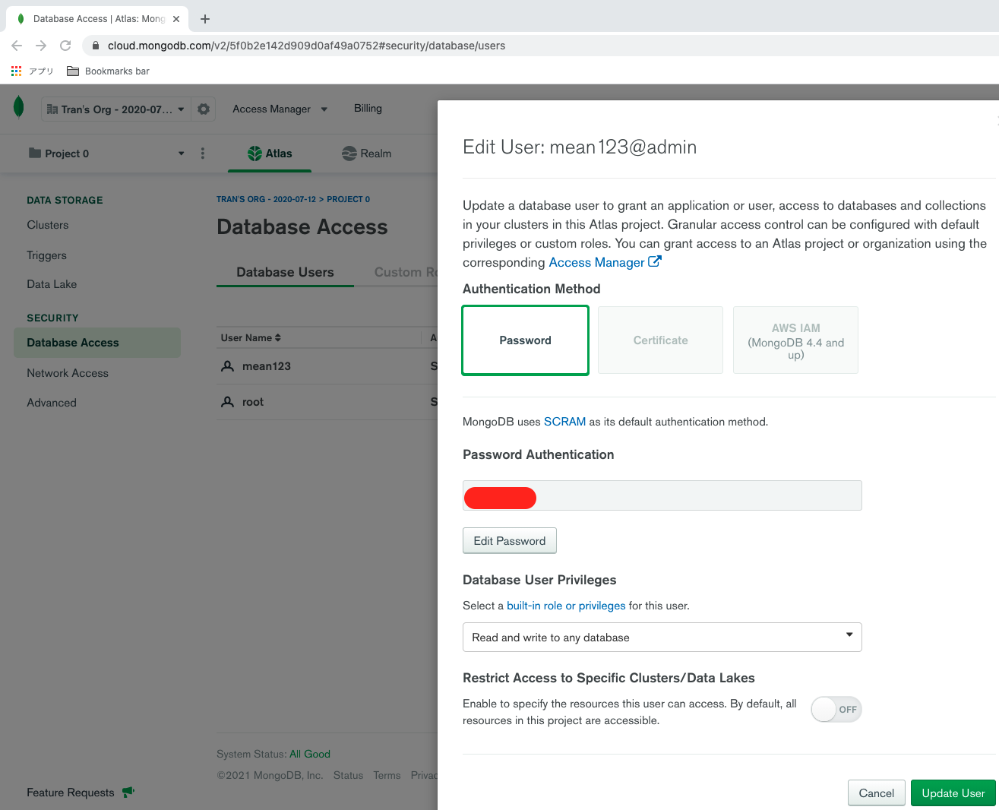
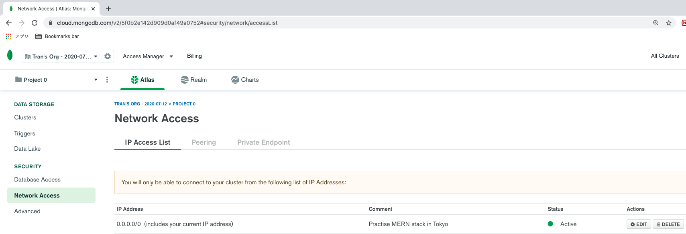
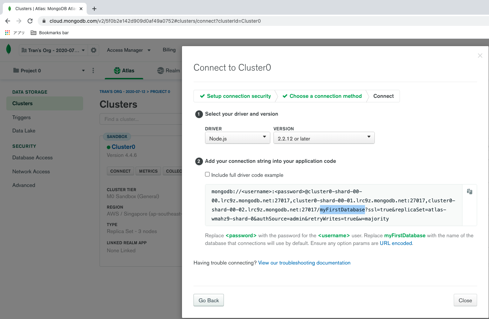
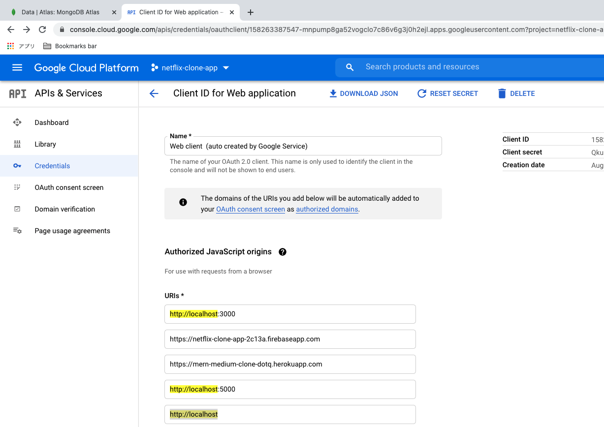
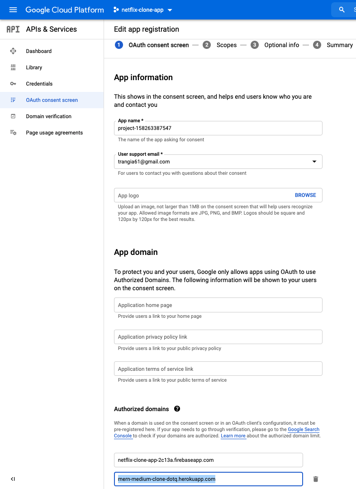
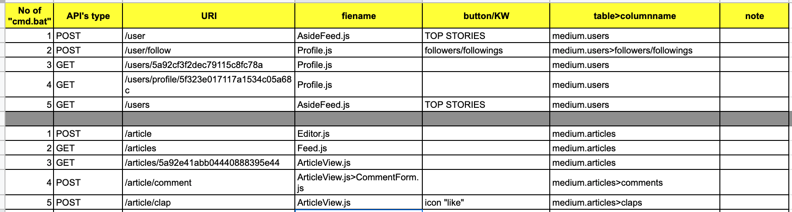

# mern-medium-clone 🚀

[](https://github.com/tquangdo/mern-medium-clone/issues/new)
***********


## deploy local
1. `$npm install`
2. 
```js
$cd server
server$nodemon index.js
server$ cd ..
$npm start
```
>OR `$npm run dev`
4. access "localhost:5000"

## heroku

### install
- `npm i -g heroku`
### dashboard on website

***********
### setting
https://github.com/tquangdo/node-zoom-clone-app/blob/master/memo.txt
#### check buildpacks
- `heroku buildpacks -a mern-medium-clone-dotq`
- -> `heroku/nodejs`

#### config vars
1. `ATLAS_URI`: https://github.com/tquangdo/mern-medium-clone/blob/master/server/index.js#L13
2. `REACT_APP_DOMAINNAME`: https://github.com/tquangdo/mern-medium-clone/blob/master/react-ui/src/constants/ConfigConst.js#L1

## atlas
- file: https://github.com/tquangdo/mern-medium-clone/blob/master/react-ui/.env
- dbname: `medium`

- username: `mean123`

- Network Access: NW Access > IP Whitelist > Add IP address > Whitelist Entry: "0.0.0.0/0"

- Cluster connect: Clusters > Cluster0: Overview > Connect > Connect your application > Driver="Node.js" & Version="2.2.12 OR LATER"!!!


## GG_CLIENT_ID
* file: https://github.com/tquangdo/mern-medium-clone/blob/master/react-ui/src/constants/ConfigConst.js#L2
>tra GG: "npm react-google-login"
* "console.developers.google.com/apis/credentials" -> project: `netflix-clone-app` -> create "OAuth 2.0 Client IDs" -> edit "Authorised JavaScript origins"
 -> Add URI: "http://localhost:3000" & "http://localhost:5000"

***********
* with PROD (Heroku): add OAuth consent screen


## api
https://github.com/tquangdo/mern-medium-clone/blob/master/server/assets/cmd/cmd.bat


## note
* `cloudinary`: upload image như busboy
* file: "https://github.com/tquangdo/mern-medium-clone/blob/master/server/index.js"

