# mern-medium-clone 🚀

[](https://github.com/tquangdo/mern-medium-clone/issues/new)
***********
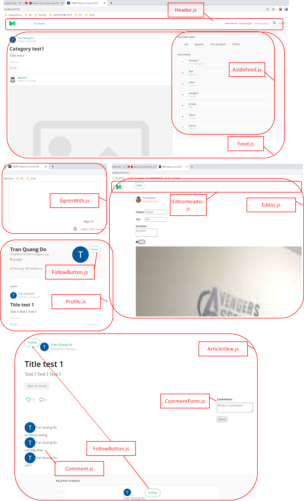

## deploy local
### BE
1. `$npm i`
### FE
1. `cd react-ui`
2. `$npm i`
3. `$npm run dev`
>if NOT run at `react-ui $`, there will have error because can NOT read  `react-ui/.env` 
4. access "localhost:3000"
>"localhost:5000" is for BE server

## heroku

### install
- `npm i -g heroku`
### dashboard on website
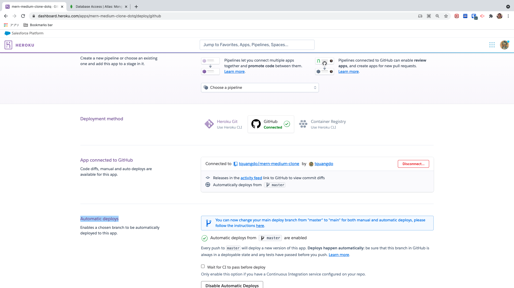
***********
### setting
https://github.com/tquangdo/node-zoom-clone-app/blob/master/memo.txt
#### check buildpacks
- `heroku buildpacks -a mern-medium-clone-dotq`
- -> `heroku/nodejs`
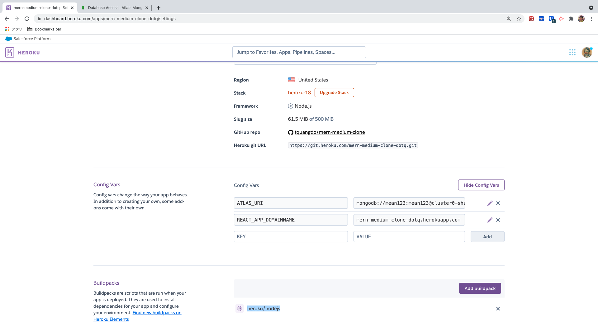
#### config vars
1. `ATLAS_URI`: https://github.com/tquangdo/mern-medium-clone/blob/master/server/index.js#L13
2. `REACT_APP_DOMAINNAME`: https://github.com/tquangdo/mern-medium-clone/blob/master/react-ui/src/constants/ConfigConst.js#L1

## atlas
- file: https://github.com/tquangdo/mern-medium-clone/blob/master/react-ui/.env
- dbname: `medium`
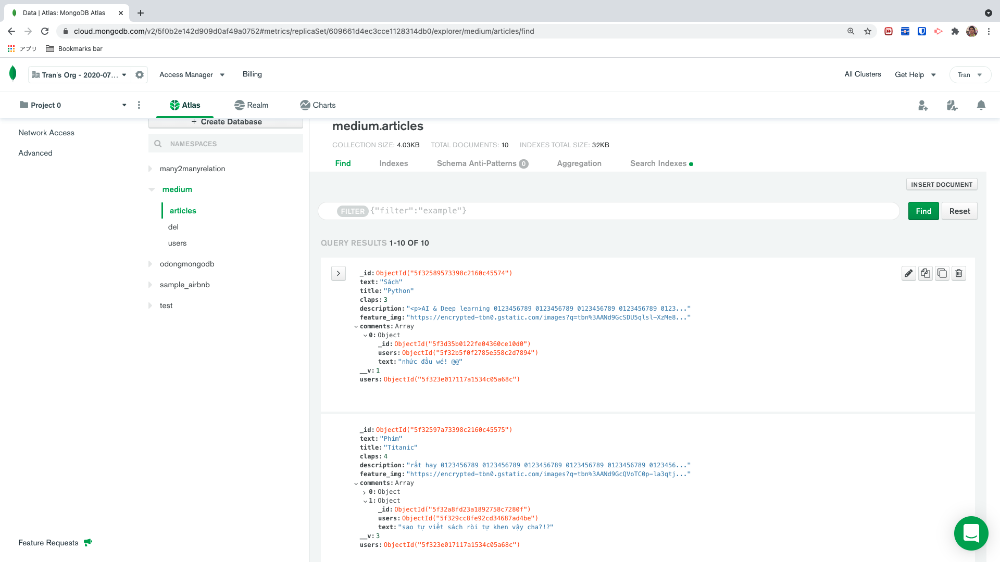
- username: `mean123`
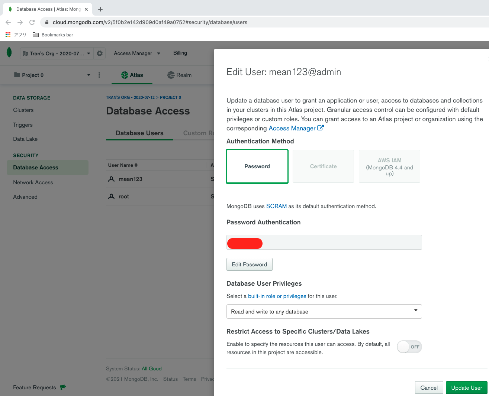
- Network Access: NW Access > IP Whitelist > Add IP address > Whitelist Entry: "0.0.0.0/0"
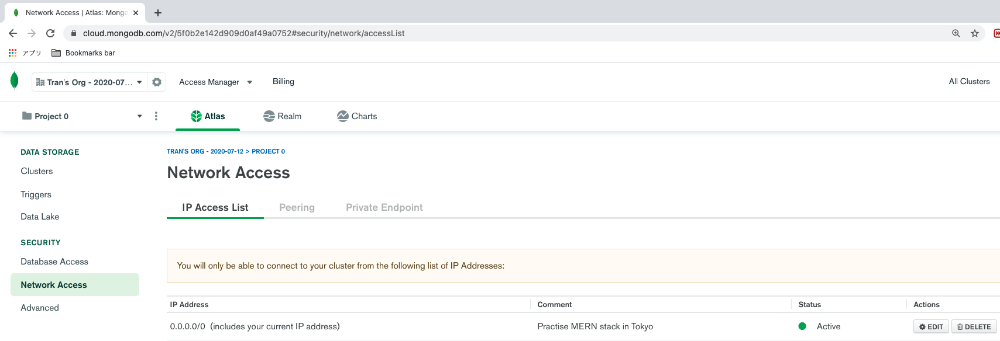
- Cluster connect: Clusters > Cluster0: Overview > Connect > Connect your application > Driver="Node.js" & Version="2.2.12 OR LATER"!!!
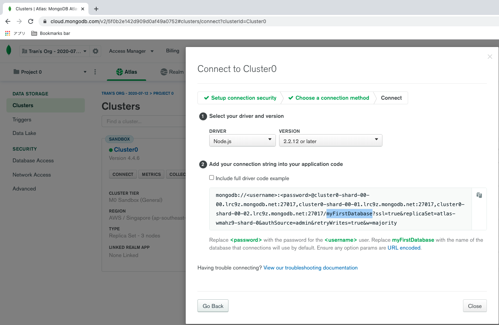

## GG_CLIENT_ID
* file: https://github.com/tquangdo/mern-medium-clone/blob/master/react-ui/src/constants/ConfigConst.js#L2
>tra GG: "npm react-google-login"
* "console.developers.google.com/apis/credentials" -> project: `netflix-clone-app` -> create "OAuth 2.0 Client IDs" -> edit "Authorised JavaScript origins"
 -> Add URI: "http://localhost:3000" & "http://localhost:5000"
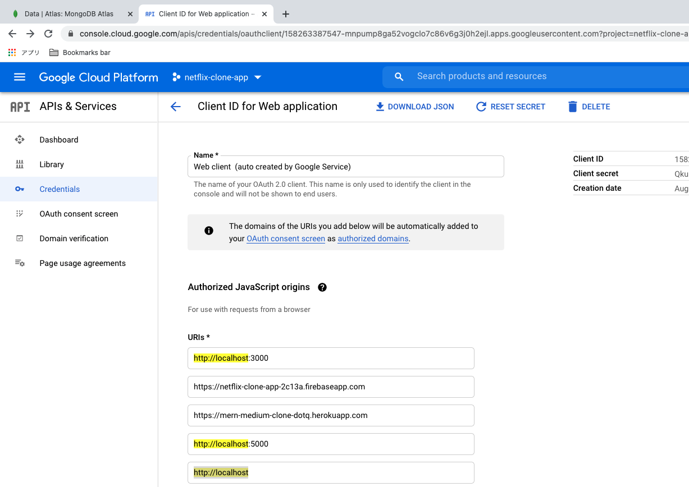
***********
* with PROD (Heroku): add OAuth consent screen
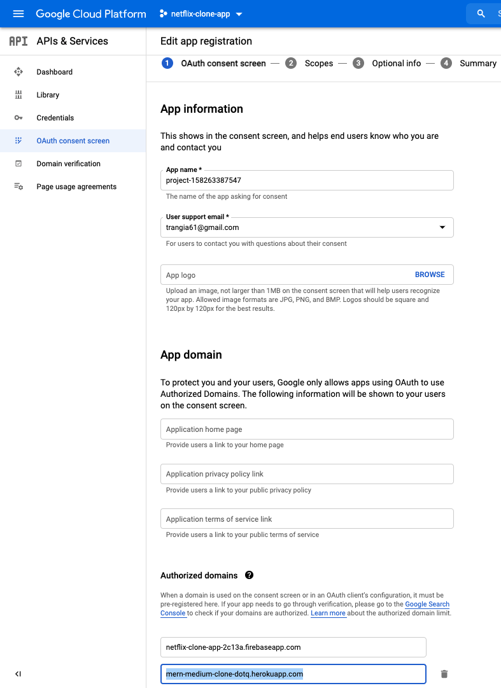

## api
https://github.com/tquangdo/mern-medium-clone/blob/master/server/assets/cmd/cmd.bat
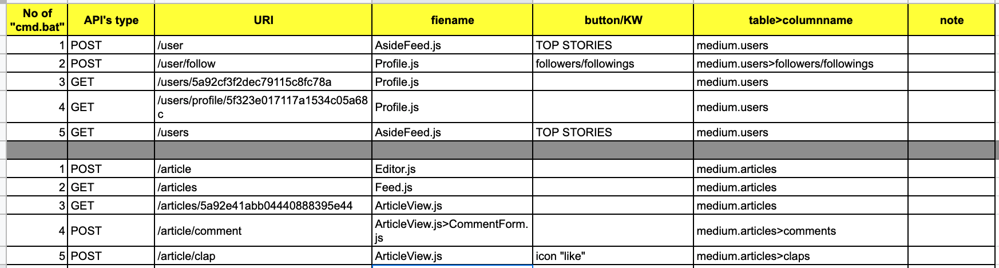

## note
* `cloudinary`: upload image như busboy
* file: "https://github.com/tquangdo/mern-medium-clone/blob/master/server/index.js"

## scribe doc generator
https://scribe-js.readthedocs.io/

### 1) install
```shell
cd server
server$ npm i @knuckleswtf/scribe-express
```
- => create `server/.scribe.config.js`

### 2) setting
1. `server/.scribe.config.js`: postman & openapi: `enabled: true`
2. `server/index.js`: change to `const url = 'mongodb...'`

### 3) generate
```shell
cd server
server$ npx scribe generate -a index
```

### 4) result
1. access browser `file:///Users/NC00011462/Documents/GitHub/mern-medium-clone/server/public/docs/index.html#endpoints`
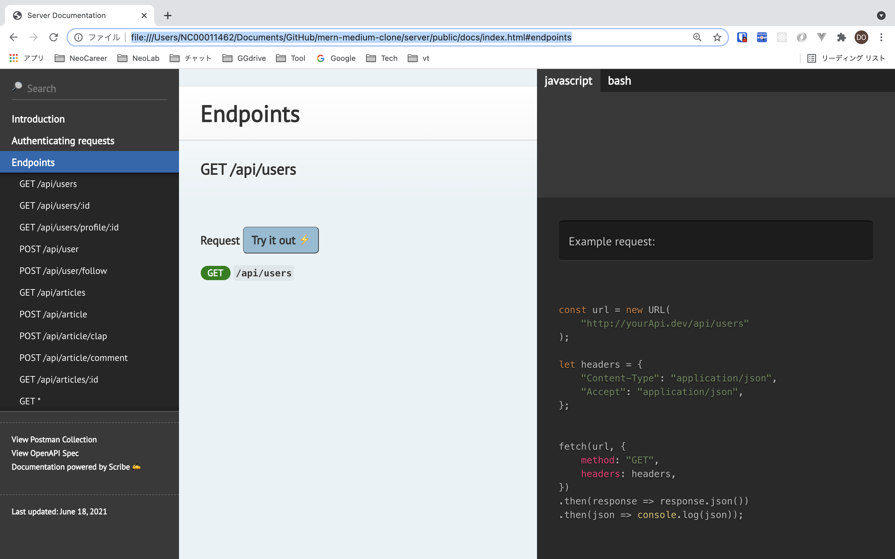
2. click `View Postman collection`
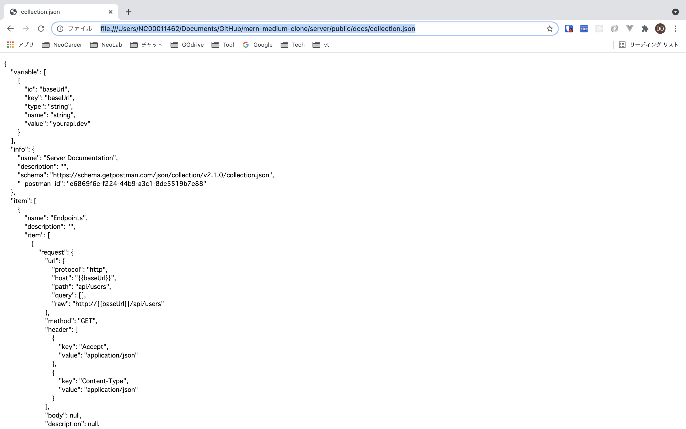

